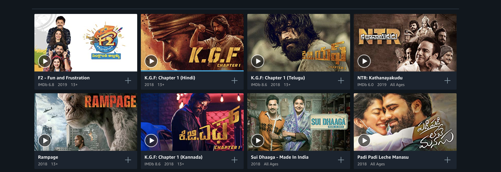

## Problem Statement

We want to build a simple reusable component which gives a grid view of cards or a list view ( Similar to what Amazon Prime has which shows list of movies in a carousel effect and when you click on See More it just redirects to grid page.)

We want to build a similar component where carousel accepts the card or the grid and list can also accept the same card.




*Images are taken from Amazon Prime.*

As it can be seen in both the images there are some common cards which can be reused in both effects. 

We will see how ng-template,ngTemplateOutlet  helps here. 


## Building the component

We build components and they should be easily consumable. For users to consume it i have created and 
published a npm library which will contain a carousel and a card component. 

For creating or publishing there is no better series than 
[The Angular Library Series — Publishing](https://blog.angularindepth.com/the-angular-library-series-publishing-ce24bb673275)

## Carousel Component

Building a carousel component is iteself a seperate task. For this post focus is on using ng-template, 
so building a carousel we will take in a seperate post. 

We will use [Owl Carousel](https://www.npmjs.com/package/ngx-owl-carousel) for carousel effects. 

Below is the html which uses owl-carousel. 

> Inside the owl-carousel component it can have any outlet which user projects. It can be a simle card, 
image or a div. 

```html
<div class="carousel-container" *ngIf="data && data.length">
  <owl-carousel #owlElement
      [options]="{items: 1, dots: false, navigation: false}"
      [items]="data"
      [carouselClasses]="['owl-theme', 'row', 'sliding']">
    <div class="item" *ngFor="let item of data;let i = index">
        <!-- Project the content here using ng-template-outlet-->
        <ng-container *ngTemplateOutlet="cardItemTmpl;context: {$implicit: item}"></ng-container>
    </div>
  </owl-carousel>
  <div class="arrow-left" (click)="onLeft($event)"></div>
  <div class="arrow-right" (click)="onRight($event)"></div>
</div>
```
> Component accepts input of ImageData and references to ownElement and cardItemTmpl. ( Name can be anything ) 
```js
@Input() public data: ImageData[]  = [];
@ViewChild('owlElement') owlElement: OwlCarousel
@ContentChild(TemplateRef) cardItemTmpl: TemplateRef<any>;
constructor() {
  console.log(this.data);
}
public ngOnChanges() {
  console.log('on changes', this.data);
}
public onLeft(event) {
  this.owlElement.previous([200]);
}
public onRight(event) {
  this.owlElement.next([200]);
}
```
## Card Component

> Its a simple card component taken from [Materialize](https://materializecss.com/cards.html)

```html
<div class="col s12 m7" *ngIf="item">
  <div class="card">
    <div class="card-image">
      
      <span class="card-title">{{ item.title }}</span>
    </div>
    <div class="card-content">
      <p>{{ item.description }} </p>
    </div>
    <div class="card-action">
      <a href="#">This is a link</a>
    </div>
  </div>
</div>
```
> Component contains input which will be data for a single card.
```js
  @Input() public item: ImageData;
```
## App Consumers

Now comes the main point of apps which will consume this components. Lets have its html in place

#### Carousel View

`<sank-carousel>` component has been passed imagesData and is viewed when its a carousel view.
Using ng-template we can provide the templateRef `sank-carousel` has to parse and pass the context 
also as item. This context has been passed to the `sank-card` component which is an input to this
component. 

#### Grid View

For grid view we just have a for loop iterating over a `sank-card` component. 

```html
<button (click)="setViewToCarousel()">Carousel View</button>
<button (click)="setViewToGrid()">Grid View</button>

<sank-carousel [data]="imagesData" *ngIf="isCarouselView()">
  <ng-template #cardItem let-item>
      <sank-card [item]="item"></sank-card>
  </ng-template>
</sank-carousel>

<div class="row" *ngFor="let data of imagesData">
  <ng-container *ngIf="isGridView()">
      <sank-card [item]="data"></sank-card>
  </ng-container>
</div>
```
> Component has just the imagesData passed to the components.
```js
constructor() {
  this.imagesData = [{
    title: 'Image 1',
    description: 'Image 1 desc',
    image: 'https://www.isoi.edu.pk/system/files/node_gallery/13997705508_a218e00c81_b_1.jpeg'
  }, {
    title: 'Image 1',
    description: 'Image 1 desc',
    image: 'https://www.isoi.edu.pk/system/files/node_gallery/sample1_l_1.jpeg'
  }];
}
```

ng-template here helps us to project the content using templateRef. We can give multiple templateRef
in the reusable components and pass the context ( ng-content doesn't allow passing the context). 

The complete source code can be found here [ng-lib-sank](https://github.com/sanketmaru/ng-lib-sank).
This repo contains carousel, card component as well the app consuming it [App](https://github.com/sanketmaru/ng-lib-sank/blob/master/src/app/app.component.html)

If there is any better way of achieving, would love to hear the views. 